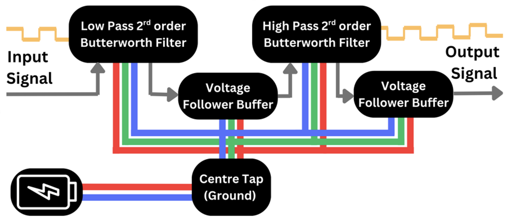
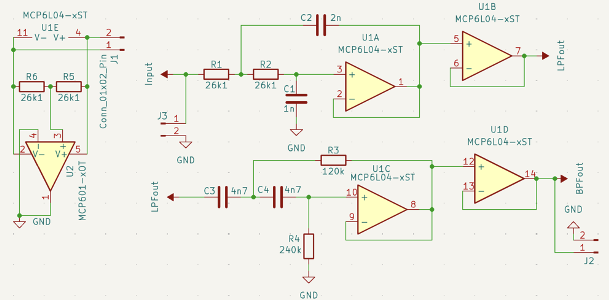
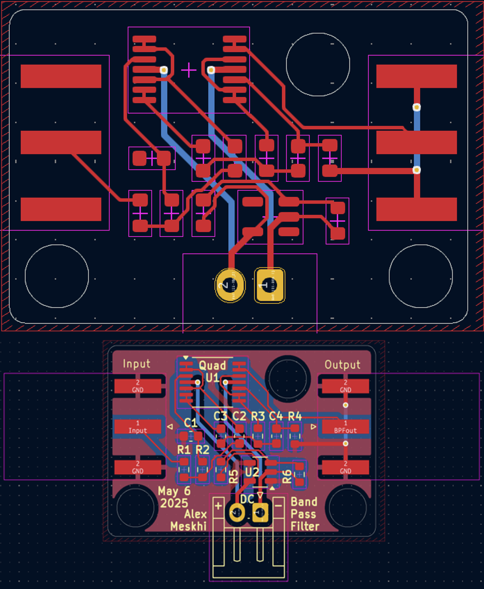
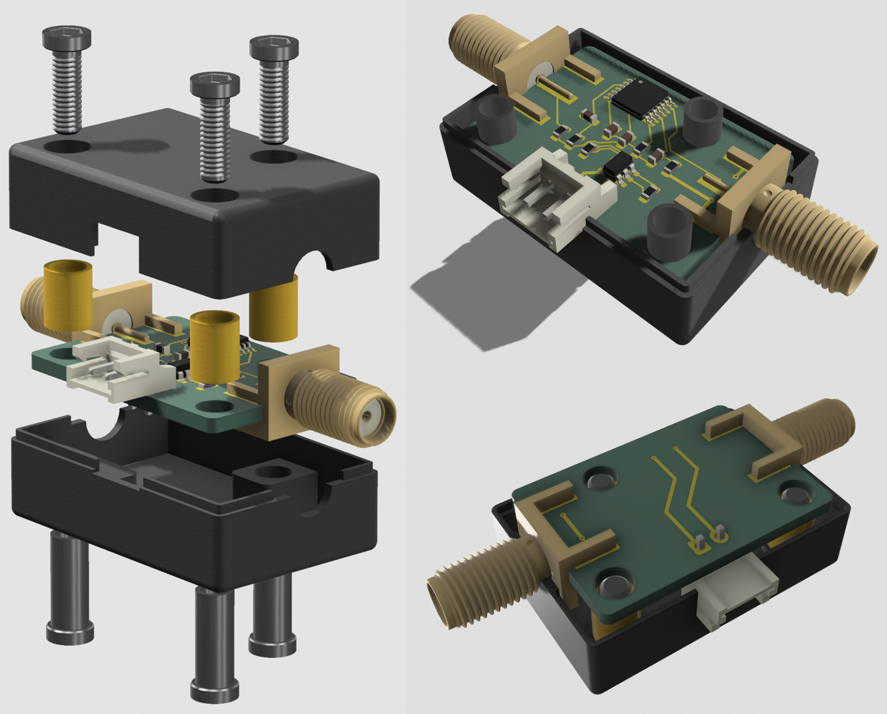

# Band-Pass Filter PCB Design

A KiCad-based PCB design and circuit implementation of a 2nd-order Sallen-Key Butterworth band-pass filter, developed as part of the Technical Design module at the University of Surrey.

---

## Overview

This project implements a band-pass filter with cutoff frequencies of 200 Hz and 4 300 Hz, suitable for audio and telecommunication applications. The design combines:

- A 2nd-order Sallen-Key low-pass stage  
- A 2nd-order Sallen-Key high-pass stage  
- Centre-tap virtual ground generation  
- PCB layout optimized for JLCPCB manufacturing  
- 3D-printable enclosure design  

---

## Features

- **Accurate Butterworth response** with flat passband and 40 dB/decade roll-off  
- **SMD components** for compact footprint and low parasitics  
- **Centre-tap virtual ground** using an op-amp buffer  
- **Full KiCad project** with schematic, PCB, and 3D model  
- **Enclosure design** for 3D printing in PETG
- Simulation testing and design details available in the [report](https://github.com/Meskh/PCB-BPF/blob/main/report.pdf)   

---

## Circuit Design

1. **Conceptual diagram** shows block stages: LPF → buffer → HPF → buffer.  
   <figure>
      
    </figure>  
2. **Stage schematics** for 2nd-order Sallen-Key LPF and HPF.  
3. **Centre-tap circuit** using a voltage divider and op-amp in follower mode.  
4. **Full BPF schematic** combining all stages with quad-op-amp and virtual ground.
   <figure>
      
    </figure>  

## PCB Layout

- Two-layer FR-4 board (29 × 20 mm, 1.6 mm thick)  
- SMD 0603 resistors and capacitors  
- JST EH connector for DC power  
- SMA edge-mount connectors for input/output  
- Full copper ground pours front and back  
- Four mounting holes for enclosure attachment
  <figure>
      
    </figure>  

## 3D Model & Enclosure

- **PCB 3D model** exported from KiCad for visual verification  
- **Enclosure** designed in CAD (PETG, 3D print) with cutouts for SMA/DC connectors  
- **Barrel nut & bolt spacers** for secure PCB mounting
  <figure>
      
    </figure>  

## Technologies

- **KiCad v6** for schematic capture and PCB layout
- **Multisim** for circuit testing and frequency response
- **Ngspice** for additional circuit simulation within KiCad  
- **Shapr3D** for enclosure modeling  

## Credits & Acknowledgements

- Developed by Aleksandre Meskhi at the University of Surrey.  
– GitHub: [meskh](https://github.com/Meskh)
– Linkedin: [Aleksandre Meskhi](https://www.linkedin.com/in/aleksandre-meskhi/)
